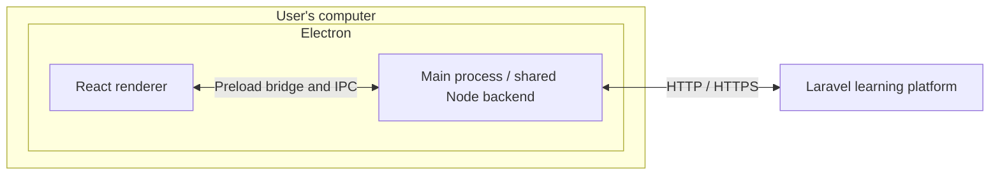
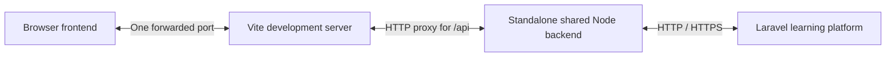

# Separate the desktop client from the learning platform

Status: Accepted  
Date: 2026-09-24

Junior Mode needs a new Electron application that can perform work on the user's computer and communicate with the existing Laravel learning platform. Developers also need to edit the client on a remote server and preview its UI from their own machine. The existing React/Inertia screens belong to the learning platform; they are not the new desktop frontend.

## Decision

Keep the applications together in this repository, with explicit runtime boundaries:

- `apps/learning-platform` contains the complete Laravel application, its React/Inertia website, database migrations, tests, dependencies, configuration, and Laravel-specific tooling. It owns authentication, authorization, and durable learning state.
- `apps/web` contains the new, independent React frontend shared by Electron and browser preview.
- `apps/backend` contains the local Node application service. It owns client-side platform communication and is the boundary for future local-machine capabilities.
- `apps/desktop` contains the Electron shell, preload bridge, and IPC handlers. It hosts the shared backend service in Electron's main process.

The desktop frontend calls named capabilities through a restricted preload bridge and IPC. The main process calls Laravel over HTTP. There is no separate Node server process or listening HTTP port inside the desktop app today.

Laravel's address is configurable. It can run on the same computer or on another server. Electron does not bundle or start PHP, Laravel, or the platform database.

For browser preview, run the same backend service in a standalone Node HTTP process. Vite serves the frontend and proxies `/api` to that process, giving the browser one origin and one port to forward. The frontend's transport adapter selects the preload bridge when available and the HTTP adapter otherwise.

The renderer must not communicate directly with Laravel or receive unrestricted Node, filesystem, or IPC access. Both transports call the same backend capabilities; application behavior belongs in that service rather than being duplicated in the transport handlers.

## Consequences

The client can develop and build independently of PHP. A root pnpm workspace manages JavaScript dependencies for all four applications, with one `pnpm-lock.yaml` and per-application manifests. Internal Node dependencies use `workspace:*`. Laravel retains its own Composer dependencies, `composer.lock`, and checks inside `apps/learning-platform`. Root commands orchestrate development and validation without coupling the runtime applications.

Packaged Electron applications load bundled frontend assets. During development, Electron may load a Vite URL, including one forwarded from a remote server. This changes where the frontend assets come from, but the Electron backend still runs on the user's computer. In browser preview, the Node backend runs on the machine hosting the preview. Consequently, `localhost` in the platform address refers to the backend's machine in each mode.

Browser preview covers the shared UI and service behavior. Native desktop capabilities require Electron testing or an explicit browser alternative. Electron IPC handlers validate the sending frame and expose specific operations rather than arbitrary network or filesystem access.

The initial implementation only checks platform compatibility through `GET /api/v1/health` and saves the chosen address. A successful connection check is not authentication. Learning-platform account sign-in and desktop coaching workflows remain to be implemented; this decision does not select their authentication protocol. Local Codex chat execution is specified separately in [ADR 0004](0004-run-codex-through-the-local-backend.md).

This decision adds a client surface without replacing [ADR 0001](0001-separate-coaching-policy-from-learning-state.md): the existing Codex plugin still owns its coaching policy and the platform still owns durable learning state.

See the [repository guide](../../README.md) for directory structure, setup, preview, and verification commands.
