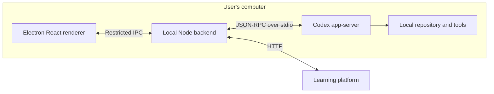

# Run Codex through the local backend

Status: Accepted  
Date: 2026-09-24

Junior Mode needs an integrated chat interface that runs Codex against the user's repositories. Local repositories are the first target. Loading the frontend from the t3 development server must not move Electron's code execution to that server.

## Decision

`apps/backend` owns a managed `codex app-server` child process. It initializes the JSON-RPC stdio connection, starts/resumes threads, submits and interrupts turns, receives item events, and routes approval/input requests to the user. Codex owns model access, agent execution, tools, and transcript persistence. Use the user's installed Codex CLI and existing login/configuration; do not embed a separate agent loop or store Codex credentials in Laravel.

The browser preview uses the same service with HTTP commands and an SSE state stream through the existing Vite proxy. Its Codex process and repository paths belong to the preview server. The UI explicitly identifies the execution host. Electron always uses its local IPC backend, including when its frontend assets come from remote Vite.

Expose named chat capabilities, not arbitrary Codex RPC, shell commands, or filesystem access. Validate Electron sender frames and the browser origin/custom-header boundary for both commands and the stream. Repository paths must be absolute existing directories. New/resumed threads use `workspace-write`, `on-request`, and user-reviewed approvals. Show command/file approval decisions and Codex questions; unsupported request types fail explicitly without granting access.

## Consequences

The first integration supports one running turn per backend, streamed plain-text replies and tool activity, interruption, and resuming Junior Mode chats. A local index stores chat IDs, titles, and repository paths beside the app's connection settings; transcripts remain in Codex storage. Only indexed Junior Mode chats are exposed. Child-process failures become visible app errors, and closing the backend terminates its Codex process.

Developers can test the shared service and browser/desktop transports using a deterministic app-server fixture without model usage or real repository edits. The initial protocol compatibility check used Codex CLI 0.155.1 and its generated schema; generated transport details stay behind the application's own API.

The initial UI uses CLI-based sign-in and the configured Codex model. Model selection, attachments, additional protocol request types, and remote repository execution from Electron are subsequent work.

This does not replace [ADR 0001](0001-separate-coaching-policy-from-learning-state.md). A Codex chat is not automatically a Coaching Session, and choosing a folder does not enroll it. The existing plugin remains the coaching policy layer, while Laravel remains responsible for durable learning state. Connecting that workflow to the desktop chat is a separate integration.

Protocol reference: [Codex App Server](https://learn.chatgpt.com/docs/app-server).
